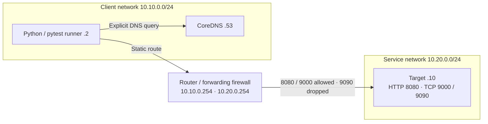

# Network E2E test framework

Python framework and reproducible lab for validating network behavior across
routed container topologies. It separates endpoint observations from lab setup,
so the same probes and pytest scenarios can target a provisioned IPv4 environment
by replacing the configuration.



Six E2E tests cover an exact A-record answer, NXDOMAIN, an allowed TCP connection,
HTTP status/body through the router, the selected gateway/interface, and a dropped
TCP connection with an HTTP positive control. Both TCP ports really listen on the
target. Orchestration verifies 9090 directly from the service side before testing
denial from the client. A timeout alone does not prove a firewall drop outside
this controlled topology.

## Run locally

Use Python 3.11 or 3.12:

```sh
python -m venv .venv
# POSIX: source .venv/bin/activate
# PowerShell: .venv\Scripts\Activate.ps1
python -m pip install -c requirements-dev.lock '.[dev]'
python -m ruff check .
python -m ruff format --check .
python -m mypy
python -m pytest
nete2e check-config
```

Default pytest runs unit tests plus real loopback TCP, UDP DNS and HTTP checks.
Those loopback checks do not establish router or firewall correctness. Constraints
pin the development dependency resolution; the library metadata retains compatible
ranges. Updating the constraints requires rerunning both Python CI versions.

For the lab, start Docker Engine with Linux containers and Compose v2. Use a
dedicated daemon without overlapping 10.10.0.0/24 or 10.20.0.0/24 networks:

```sh
python scripts/run_e2e.py --repeat 2 --scenarios
```

This builds images, runs two clean baselines, then fresh firewall and DNS
regressions, and tears down each project. `--no-build` reuses existing local lab
images. No host ports or external services are needed at runtime. Image builds
need internet access. Serialize lab invocations on a shared daemon because
project names isolate resources but do not eliminate fixed-subnet conflicts.

The firewall regression recreates the router with TCP 9000 dropped; only the
allowed-TCP assertion should fail. The DNS regression serves 10.20.0.99 instead
of 10.20.0.10; only the known-name assertion should fail. Both scenarios establish
normal readiness before injecting the fault. The harness validates JUnit failure
identities and messages and requires all control tests to pass. Expected failures
are retained as evidence, not presented as passing baseline tests.

## Reuse the probes

```python
from nete2e.assertions import assert_tcp_reachable
from nete2e.probes.tcp import probe_tcp

result = probe_tcp("198.51.100.10", 9000, timeout=2)
assert_tcp_reachable(result, environment="staging/client")
```

Copy `environments/example.yaml`, set actual endpoints and expected routes, then:

```sh
nete2e --config my-environment.yaml check-config
nete2e --config my-environment.yaml probe dns
nete2e --config my-environment.yaml probe tcp
nete2e --config my-environment.yaml probe http
nete2e --config my-environment.yaml probe route
nete2e --config my-environment.yaml ready
NETE2E_CONFIG=my-environment.yaml python -m pytest tests/e2e
```

In PowerShell, set `$env:NETE2E_CONFIG='my-environment.yaml'` before pytest.
Route assertions require Linux and `iproute2`; missing tooling is reported as
unsupported and does not silently skip a required test. External environments
must provide their own setup, return routing and live-listener controls. No cloud
or VM provider compatibility is claimed without execution there.

TCP and HTTP deliberately take numeric IPv4 addresses. DNS uses the configured
resolver explicitly. HTTP sends the configured hostname as Host and does not
follow redirects or use environment proxies. HTTP success as a transport result
is distinct from the health assertion's required 200 and JSON body. Bodies are
limited to 1 KiB, and requests have an overall deadline. The synchronous HTTP
probe is intended for ordinary pytest/CLI callers outside a running event loop.

## Diagnose a failure

Assertions include destination, protocol, category, elapsed time, source
environment and available route evidence. `artifacts/<run-id>/` contains JUnit,
pytest output, lifecycle logs and per-test JSON evidence. On failures it also
contains runner addressing/routes/resolver configuration, an explicit DNS query,
a TCP result, router rules/counters and bounded service logs. Collection errors
are recorded without replacing the original failure.

Use `project.json` in an artifact directory to identify a project if interruption
or daemon failure prevents teardown. From this repository, run
`docker compose -p <project> down --volumes --remove-orphans --timeout 5` once the
daemon is available. Only clean up the recorded project. The normal script
attempts cleanup in `finally`, including on Ctrl+C and SIGTERM; no program can
guarantee cleanup after SIGKILL or loss of the daemon.

## Security and limits

The router receives only NET_ADMIN. Runner and target receive NET_ADMIN to install
routes plus SETPCAP, SETUID and SETGID to drop all capabilities and run as UID/GID
10001. CoreDNS runs as UID/GID 10001 with NET_BIND_SERVICE in its bounding set
because the upstream executable carries that file capability; its network
namespace also permits binding port 53 without privilege escalation.
Filesystems are read-only except explicit temporary/output mounts. There is no
privileged container, Docker socket mount, host networking or host firewall edit.
Docker itself manages its normal bridge networks on the daemon host.

Artifacts expose internal addressing and resolver settings; review storage access
when targeting private infrastructure. The local artifact output directory is
writable by the unprivileged runner. Configuration contains no command strings,
imports, authentication fields or credentials.

Scope is IPv4 A records, plain HTTP, TCP connect behavior and Linux route lookup.
There is no libc resolver integration, IPv6, TLS, throughput measurement or path
trace. DROP is the negative policy contract; REJECT requires a distinct assertion.
The lab image base tag and Debian packages are not digest/snapshot pinned, so
rebuilds may receive updates even with pinned Python constraints.

IPsec/VPN is not implemented or validated. An extension would need an isolated
kernel XFRM-capable lab, real IKE/ESP security associations and traffic/counter
evidence. Base connectivity is not evidence of encryption.

## CI and validation status

GitHub Actions defines quality checks, Python 3.11/3.12 tests and Linux container
E2E. GitLab defines quality, unit, build and E2E stages. GitLab build/E2E jobs
require a dedicated Linux **shell** runner tagged `docker-shell`, with Docker
Engine, Compose v2 and Python installed. They do not use a privileged nested
daemon. A resource group serializes shared lab jobs. GitLab's test summary ingests
baseline reports; expected regression failures remain downloadable artifacts.

Validated in [GitHub Actions run 34188654659](https://github.com/mufazzalshokh/network-e2e-test-framework/actions/runs/34188654659):
Ruff, strict mypy, all 78 unit/loopback tests on Python 3.11 and 3.12, image builds,
two clean six-test E2E baselines, and both deliberate regressions. Each regression
produced exactly one expected failure and five passing controls. Failure artifacts
include observed DNS answers, routes and firewall counters; teardown completed for
all four topology instances. Expected fault assertions remain visible in artifacts.

Local Python 3.12 tests, compilation, package installation, CLI checks, Actionlint,
and Compose/CI structural checks also passed. The local Windows Docker Desktop
engine was unavailable, so actual container verification ran on GitHub's Linux
runner. Hosted GitLab CI has not been executed; its configuration has been checked
structurally.

See [architecture](docs/architecture.md) and [testing strategy](docs/testing-strategy.md).
Platform semantics follow the [Compose network reference](https://docs.docker.com/reference/compose-file/networks/),
[dnspython resolver API](https://dnspython.readthedocs.io/en/stable/resolver-class.html),
and [GitLab shell runner Docker guidance](https://docs.gitlab.com/ci/docker/using_docker_build/).
